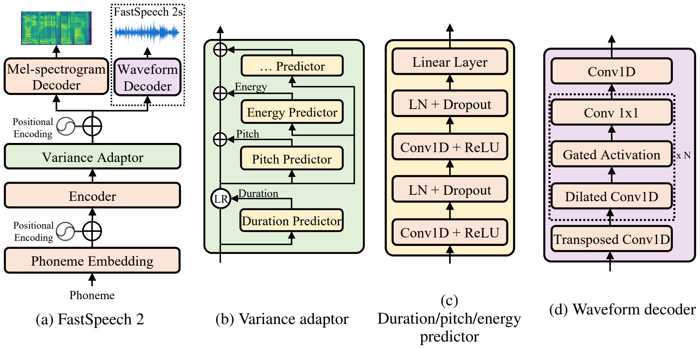

# 基于espnet的文本转语音模型的TensorRT部署与加速

本仓库是 “英伟达TensorRT加速AI推理 Hackathon 2022 —— Transformer模型优化赛” 的 “edvince” 队伍的复赛仓库。

## 总述

使用TensorRT部署及加速espnet的文本转语音(TTS)模型。

 - 原始模型：[espnet](https://github.com/espnet/espnet)
 - 优化效果：暂无
 - 运行步骤：暂无

## 原始模型

### 模型简介

 - 用途以及效果：
    - 用途：espnet是一个端到端的语音处理工具链，支持ASR(自动语音识别)，TTS(文字转语音)，SE(语音增强)，ST(语音翻译)，MT(机器翻译)，VC(语音转换)，SLU(语音语言理解)，SUM(语音摘要)。与wenet官方提供了完善的部署流程不同，espnet没有提供，因此对espnet进行部署和加速是十分有价值的。本工作主要部署加速espnet的TTS(文本转语音)模型。
    - 效果：
        - 文本：**"I am excited to participate in the NVIDIA Tensor R T Accelerated A I Inference Hackathon."**
        - espnet的TTS结果：

https://user-images.githubusercontent.com/18224516/170708125-259bb48e-6279-4d14-ae0a-39b8c9763b18.mov

 - 业界应用情况：ESPnet在github上已经收获了5.1k的star，可见其受欢迎程度。由于ESPnet是一个非流式模型，因此其常被用于离线识别，已知的有京东等公司在使用。
 - 模型结构：本仓库部署espnet(工具名字)的TTS(任务名字)的VITS(具体模型)，模型的Pytorch定义在[这](https://github.com/espnet/espnet/blob/5fa6dcc4e649dc66397c629d0030d09ecef36b80/espnet2/gan_tts/vits/vits.py#L52)，VITS是一个“端到端文本转语音的带对抗学习的条件变分自动编码器”，paper在[这](https://arxiv.org/abs/2006.04558)，模型结构如下图所示，是一个结构比较均衡的网络，前端编码器是Transformer，中间是小波变换，后端解码是1D的卷积操作，是一个综合性很强的网络。

### 模型优化的难点

## 优化过程

计划优化流程：

1. pytorch模型转onnx模型
2. onnx模型转trt模型
3. 修剪/调整onnx模型中的无参数节点
4. 预计算onnx模型中的固定节点
5. 启用trt的fp16
6. 写无参plugin替换无参的零碎算子
7. 写有参plugin替换计算负荷大的零碎算子

## 精度与加速效果

## Bug报告